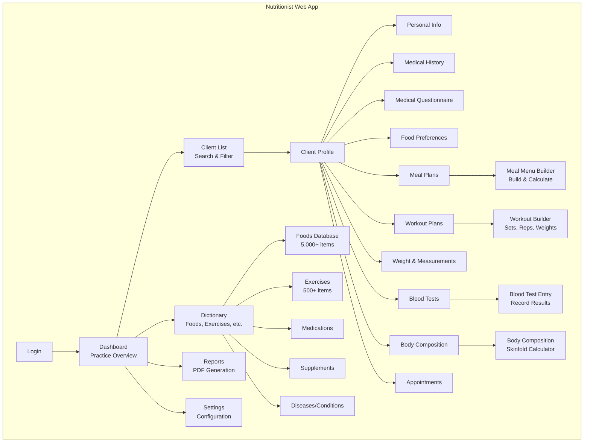
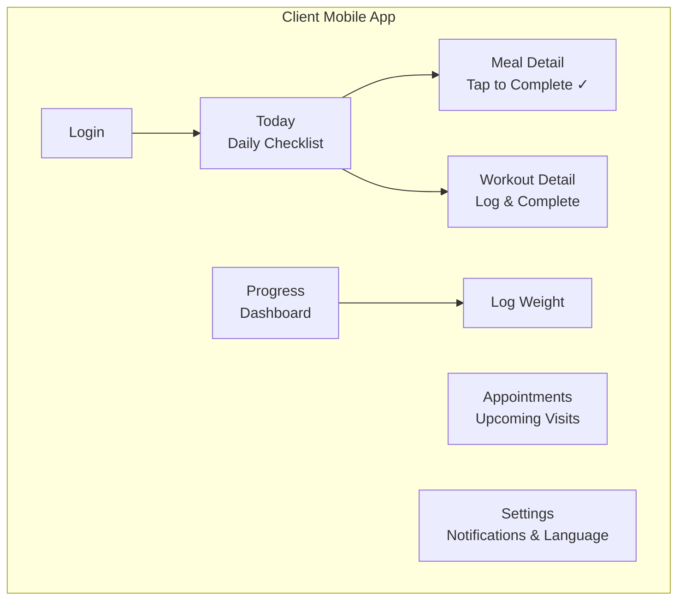
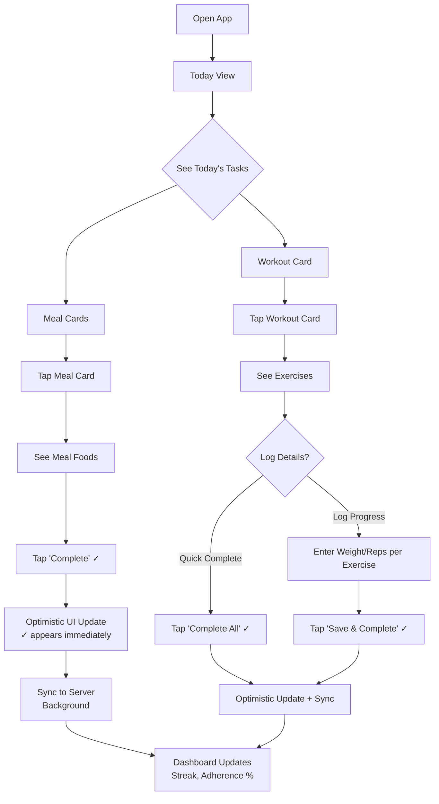
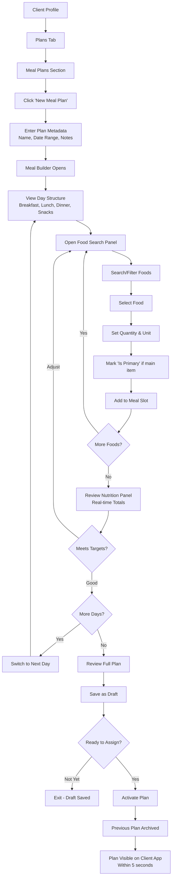
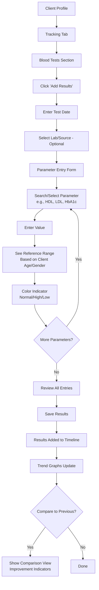
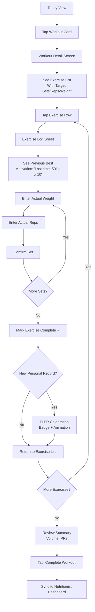
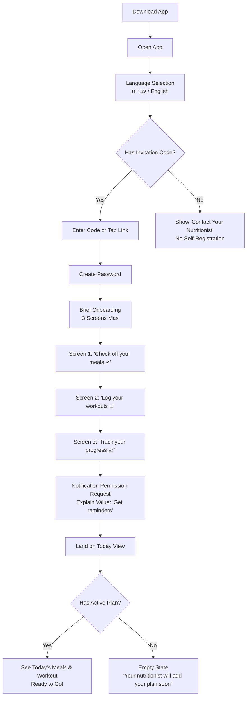

# NutriPro UI/UX Specification

**Version:** 1.0  
**Date:** January 3, 2026  
**Author:** UX Expert (Sally)  
**Status:** Ready for Design & Architecture

---

## Table of Contents

1. [Introduction](#1-introduction)
2. [Information Architecture](#2-information-architecture)
3. [User Flows](#3-user-flows)
4. [Wireframes & Mockups](#4-wireframes--mockups)
5. [Component Library / Design System](#5-component-library--design-system)
6. [Branding & Style Guide](#6-branding--style-guide)
7. [Accessibility Requirements](#7-accessibility-requirements)
8. [Responsiveness Strategy](#8-responsiveness-strategy)
9. [Animation & Micro-interactions](#9-animation--micro-interactions)
10. [Performance Considerations](#10-performance-considerations)
11. [Next Steps](#11-next-steps)

---

## 1. Introduction

This document defines the user experience goals, information architecture, user flows, and visual design specifications for **NutriPro's** user interface. It serves as the foundation for visual design and frontend development, ensuring a cohesive and user-centered experience.

### 1.1 Overall UX Goals & Principles

#### Target User Personas

**Persona 1: The Hebrew-Speaking Nutritionist (Primary)**
- **Profile:** Licensed nutritionist/dietitian in Israel, age 28-55, solo practitioner or small practice
- **Context:** Managing 20-100+ active clients, currently using outdated desktop software or spreadsheets
- **Goals:** Access clients anywhere, see adherence between visits, reduce admin time, appear modern and professional
- **Pain Points:** Desktop-bound, zero client visibility between appointments, 30+ min/day lost to workarounds
- **Tech Savvy:** Comfortable with web apps but not developers; expects things to "just work"
- **Language:** Hebrew primary, professional English terms acceptable

**Persona 2: The Nutrition Client (Secondary)**
- **Profile:** Adults seeking nutritional guidance, age 18-70, wide range of motivation levels
- **Context:** Receive meal plans from nutritionist, struggle with adherence tracking
- **Goals:** Follow their plan, see progress, feel supported, minimal friction
- **Pain Points:** Existing apps too complex (barcode scanning, calorie counting), forget plan details, lack motivation
- **Tech Savvy:** Varies widely—design for lowest common denominator
- **Language:** Hebrew primary, some English

---

#### Usability Goals

| Goal | Target Metric | Why It Matters |
|------|---------------|----------------|
| **Speed to Daily Check-in** | Client completes check-in in <30 seconds | Reduces friction = higher adherence |
| **Meal Plan Creation Efficiency** | Create weekly plan in <15 minutes | 40% time reduction vs. legacy system |
| **Zero Learning Curve (Client)** | No tutorial needed; intuitive first use | Wide range of tech literacy |
| **Remote Access Reliability** | Page load <3s, API <500ms | Cloud access is the #1 value prop |
| **Error Prevention** | Confirmation for destructive actions, inline validation | Health data is irreplaceable |
| **Memorability** | Return users productive immediately | Both personas have gaps between uses |

---

#### Core Design Principles

1. **Dual Simplicity** — Sophisticated power for professionals, radical simplicity for clients. These are two different interfaces serving two different needs; never compromise one for the other.

2. **Hebrew-First, RTL-Native** — Hebrew is the default, not a translation. Every component, layout, and interaction is designed RTL-first. English is supported but secondary.

3. **One-Tap Everything (Client)** — The client app should feel "almost too simple." Check your meal. Check your workout. See your progress. No cognitive load, no decisions beyond "did I do this?"

4. **Progressive Disclosure (Nutritionist)** — Complex features (blood tests, body composition, micronutrients) exist but don't clutter primary views. Reveal depth on demand.

5. **Real-Time Confidence** — Every action shows immediate feedback. Nutritional calculations update as foods are added. Adherence scores reflect the latest client activity. The system feels alive.

6. **Celebrate Progress** — Subtle positive reinforcement for clients (streaks, checkmarks, trends). Encouraging, not patronizing.

---

### Change Log

| Date | Version | Description | Author |
|------|---------|-------------|--------|
| Jan 3, 2026 | 1.0 | Initial UI/UX Specification | UX Expert (Sally) |

---

## 2. Information Architecture

### What This Section Covers

This section maps out **where everything lives** in both applications — think of it as the "floor plan" of NutriPro. For the nutritionist, it shows how you'll navigate your daily workflow. For developers, it establishes the routing structure and component hierarchy.

---

### Site Map: Nutritionist Web Application

**Your Digital Practice — Everything in One Place**



**For the Nutritionist:** This mirrors how you work today — start from the dashboard, find a client, dive into their profile, build plans. Everything from the desktop system is here, organized more logically.

**For Developers:** This implies ~15 route groups. Client Profile is a nested route with tab-based sub-routes. Dictionary entities share a common CRUD pattern.

---

### Site Map: Client Mobile Application

**Simple Daily Tracking — 4 Screens, That's It**



**For the Nutritionist:** Your clients will see only what they need — today's tasks, their progress, upcoming appointments. No complexity to confuse them.

**For Developers:** 4 tab screens + 3 detail/modal screens. State is minimal — mostly server-driven with optimistic UI for check-offs.

---

### Navigation Structure

#### Nutritionist Web App — Sidebar Navigation

| Icon | Label (Hebrew) | Label (English) | What's Here |
|------|----------------|-----------------|-------------|
| 📊 | לוח בקרה | Dashboard | Practice overview, alerts, recent activity |
| 👥 | לקוחות | Clients | All your clients, search, add new |
| 📚 | מאגר נתונים | Dictionary | Foods, exercises, medications, supplements, conditions |
| 📄 | דוחות | Reports | Generate PDFs for clients |
| ⚙️ | הגדרות | Settings | Configuration, your profile |

**Sidebar Position:** Right side (RTL layout) — feels natural for Hebrew readers, like reading a book.

**Within a Client Profile:**
Tabs across the top organize the 9 sections into logical groups:

| Tab | Contains |
|-----|----------|
| **סקירה (Overview)** | Personal info, status, quick stats |
| **רפואי (Clinical)** | Medical history, questionnaire, preferences |
| **תוכניות (Plans)** | Meal plans, workout plans |
| **מעקב (Tracking)** | Weight, measurements, blood tests, body composition |

**Developer Note:** Tabs are client-side routing (`/clients/:id/overview`, `/clients/:id/clinical`, etc.). Sub-sections within tabs use accordion or card patterns, not additional routing.

---

#### Client Mobile App — Bottom Tab Bar

| Position | Icon | Hebrew | English | Primary Action |
|----------|------|--------|---------|----------------|
| 1 (Right in RTL) | 📅 | היום | Today | Check off meals & workouts |
| 2 | 📈 | התקדמות | Progress | View adherence, log weight |
| 3 | 📆 | פגישות | Appointments | See upcoming visits |
| 4 (Left in RTL) | ⚙️ | הגדרות | Settings | Notifications, language |

**Why 4 tabs:** Everything a client needs, nothing more. No hidden menus, no confusion.

**Developer Note:** Tab 1 (Today) is the initial route. Deep linking should support `/today`, `/progress`, `/appointments`, `/settings`. Push notifications should deep link to relevant screens.

---

### Breadcrumb Pattern (Web App)

**Format:** `Dashboard › Clients › Sarah Cohen › Meal Plans › January Week 1`

- Always visible below the header
- Each segment is clickable
- RTL: Arrow direction reverses (‹ instead of ›)
- Maximum 5 levels deep; if deeper, show `...` for middle segments

**Developer Note:** Implement as a component that reads from route hierarchy. Consider `useMatches()` or equivalent for automatic breadcrumb generation.

---

### Key Navigation Scenarios

| Scenario | Path | Notes |
|----------|------|-------|
| Build a meal plan for a client | Dashboard → Clients → [Client] → Plans tab → Meal Plans → New/Edit | Food search panel slides in from left (LTR reference) / right (RTL) |
| Check client's blood test history | Dashboard → Clients → [Client] → Tracking tab → Blood Tests | Timeline view with expandable entries |
| Add a new food to dictionary | Dashboard → Dictionary → Foods → Add New | Form with all nutritional fields |
| Client checks off breakfast | Open app → Today tab → Tap breakfast card → ✓ | Single tap, optimistic UI, syncs in background |

---

## 3. User Flows

### Flow 1: Client Daily Check-In (Mobile App)

**User Goal:** Mark today's meals and workout as completed with minimal friction.

**Entry Points:** 
- App launch (lands on Today tab)
- Push notification tap (deep links to Today)
- Widget tap (future enhancement)

**Success Criteria:** Client completes full check-in in <30 seconds



**Edge Cases & Error Handling:**
- **Offline:** Queue check-offs locally, show "Syncing..." indicator, complete sync when connected
- **No plan assigned:** Show friendly empty state: "No meals planned for today. Contact your nutritionist."
- **Past day check-off:** Allow checking off yesterday (grace period) but not older dates
- **Accidental tap:** Completed items can be un-checked within 5 minutes (undo)

---

### Flow 2: Meal Plan Creation (Web App)

**User Goal:** Create a complete weekly meal menu for a client with accurate nutritional calculations.

**Entry Points:**
- Client Profile → Plans tab → "New Meal Plan"
- Dashboard quick action → Select client → New plan

**Success Criteria:** Nutritionist creates a 7-day plan in <15 minutes



**Edge Cases & Error Handling:**
- **Duplicate plan name:** Warn but allow (append date automatically)
- **Overlapping date range:** Show warning, require confirmation to override existing plan
- **Food not found:** Offer to add new food to dictionary inline
- **Lost connection during edit:** Auto-save every 30 seconds, recover on reconnect
- **Nutritional targets not set:** Show banner suggesting target setup, but don't block

---

### Flow 3: Recording Blood Test Results (Web App)

**User Goal:** Record a client's lab results with proper reference ranges and track trends over time.

**Entry Points:**
- Client Profile → Tracking tab → Blood Tests → "Add Results"

**Success Criteria:** Enter 10+ parameters in <3 minutes



---

### Flow 4: Client Exercise Logging (Mobile App)

**User Goal:** Log actual weight, reps, and sets for each exercise in today's workout.

**Entry Points:**
- Today tab → Tap workout card
- Push notification for workout reminder

**Success Criteria:** Log full workout in <2 minutes (for 6-8 exercises)



---

### Flow 5: Client Onboarding/First Login (Mobile App)

**User Goal:** New client successfully logs in and understands how to use the app.

**Entry Points:**
- Download app from App Store / Play Store
- Invitation link from nutritionist (SMS/Email)

**Success Criteria:** Client ready to check off first meal within 2 minutes of opening app



---

### Additional Flows Summary

| Flow | User | Priority |
|------|------|----------|
| Meal Plan Creation | Nutritionist | Critical ✅ |
| Client Daily Check-In | Client | Critical ✅ |
| Blood Test Recording | Nutritionist | High ✅ |
| Exercise Logging | Client | High ✅ |
| Client Onboarding | Client | High ✅ |
| Workout Plan Creation | Nutritionist | High (Similar to Meal Plan) |
| Body Composition Entry | Nutritionist | Medium |
| Weight/Measurement Logging | Client | Medium |
| PDF Report Generation | Nutritionist | Medium |
| Dictionary Management | Nutritionist | Medium |

---

## 4. Wireframes & Mockups

### Design Files Strategy

**Primary Design Approach:** AI-Assisted Generation + Iteration

| Tool | Purpose | When to Use |
|------|---------|-------------|
| **v0.dev / Lovable** | Generate initial UI components and screens | Early design exploration, component scaffolding |
| **Figma** | Refine, iterate, and document final designs | Once direction is validated |
| **Code-first** | Build directly from specs for simple screens | Settings, forms, lists |

**Design File Location:** `[To be created]` — Figma project link will be added when designs begin.

---

### Screen 1: Nutritionist Dashboard

**Purpose:** Practice-at-a-glance view showing client activity, alerts, and quick actions.

```
┌─────────────────────────────────────────────────────────────────────────┐
│  [Logo]                    NutriPro                    [User Menu ▼]    │
├─────────────────────────────────────────────────────────────────────────┤
│                                                          ┌────────────┐ │
│  ┌─────────────────────────────────────────────────┐    │            │ │
│  │           📊 Welcome Back, [Name]                │    │  SIDEBAR   │ │
│  │                                                  │    │            │ │
│  │  ┌──────────┐ ┌──────────┐ ┌──────────┐        │    │ Dashboard● │ │
│  │  │  Active  │ │ Check-ins│ │  Alerts  │        │    │ Clients    │ │
│  │  │ Clients  │ │  Today   │ │          │        │    │ Dictionary │ │
│  │  │    47    │ │    23    │ │    3     │        │    │ Reports    │ │
│  │  └──────────┘ └──────────┘ └──────────┘        │    │ Settings   │ │
│  └─────────────────────────────────────────────────┘    │            │ │
│                                                          │            │ │
│  ┌─────────────────────────┐ ┌─────────────────────┐    │            │ │
│  │    🔔 Alerts            │ │  📋 Recent Activity │    │            │ │
│  │ ─────────────────────── │ │ ────────────────────│    │            │ │
│  │ ⚠️ Sarah - No check-in │ │ ✓ David - Breakfast │    │            │ │
│  │    3 days               │ │   10 min ago        │    │            │ │
│  │ ⚠️ Yael - Adherence    │ │ ✓ Miriam - Workout  │    │            │ │
│  │    dropped to 45%       │ │   25 min ago        │    │            │ │
│  │ 📅 3 appointments today │ │ ✓ Avi - Lunch ✓    │    │            │ │
│  └─────────────────────────┘ │   1 hour ago        │    │            │ │
│                              └─────────────────────┘    │            │ │
│  ┌──────────────────────────────────────────────────┐   │            │ │
│  │    👥 Clients Needing Attention                  │   │            │ │
│  │ ───────────────────────────────────────────────  │   └────────────┘ │
│  │  [Photo] Sarah Cohen    42%  ████░░░░░░ [View]  │                   │
│  │  [Photo] Yael Levi      45%  █████░░░░░ [View]  │                   │
│  │  [Photo] Dan Mor        58%  ██████░░░░ [View]  │                   │
│  └──────────────────────────────────────────────────┘                   │
└─────────────────────────────────────────────────────────────────────────┘
```

---

### Screen 2: Meal Menu Builder

**Purpose:** Create and edit meal plans with real-time nutritional calculations.

```
┌─────────────────────────────────────────────────────────────────────────┐
│  ← Back to Client    Meal Plan: January Week 1    [Save Draft] [Activate]│
├─────────────────────────────────────────────────────────────────────────┤
│ ┌───────────────────────────────────────────────┐ ┌───────────────────┐ │
│ │  📅 Day Tabs                                   │ │  🔍 Food Search   │ │
│ │  [Sun][Mon][Tue][Wed][Thu][Fri][Sat]          │ │  ┌─────────────┐  │ │
│ │                                                │ │  │ Search...   │  │ │
│ │  ┌────────────────────────────────────────┐   │ │  └─────────────┘  │ │
│ │  │ 🌅 Breakfast                     [+]   │   │ │                   │ │
│ │  │ ─────────────────────────────────────  │   │ │  Categories:      │ │
│ │  │ • Oatmeal (100g)         P:5  C:27 F:3 │   │ │  [Grains] [Dairy] │ │
│ │  │ • Milk 3% (200ml) ⭐     P:6  C:10 F:6 │   │ │  [Protein][Veg]   │ │
│ │  │ • Banana (1 medium)      P:1  C:27 F:0 │   │ │                   │ │
│ │  │                         ───────────────│   │ │  Recent Foods:    │ │
│ │  │               Meal Total: P:12 C:64 F:9│   │ │  • Oatmeal        │ │
│ │  └────────────────────────────────────────┘   │ │  • Chicken breast │ │
│ │                                                │ │  • Rice           │ │
│ │  ┌────────────────────────────────────────┐   │ │                   │ │
│ │  │ 🌞 Lunch                          [+]  │   │ │                   │ │
│ │  │ • Chicken breast (150g) ⭐ P:45 C:0 F:5│   │ │                   │ │
│ │  │ • Brown rice (150g)      P:4  C:45 F:1│   │ │                   │ │
│ │  └────────────────────────────────────────┘   │ │                   │ │
│ └───────────────────────────────────────────────┘ │                   │ │
│                                                    │  📊 Daily Totals  │ │
│                                                    │  Calories: 1,847  │ │
│                                                    │  Protein:  89g 🟢 │ │
│                                                    │  Carbs:   245g 🟡 │ │
│                                                    │  Fat:      48g 🟢 │ │
│                                                    └───────────────────┘ │
└─────────────────────────────────────────────────────────────────────────┘
```

---

### Screen 3: Workout Plan Builder

**Purpose:** Create and edit workout programs with sets/reps/weight configuration.

```
┌─────────────────────────────────────────────────────────────────────────┐
│  ← Back to Client    Workout Plan: Strength Program A   [Save] [Activate]│
├─────────────────────────────────────────────────────────────────────────┤
│ ┌─────────────────────────────────────────────────┐ ┌───────────────────┐│
│ │  📋 Plan Details                          [Edit]│ │  🔍 Exercise Search││
│ │  Name: Strength Program A                       │ │  ┌─────────────┐  ││
│ │  Type: Strength Training                        │ │  │ Search...   │  ││
│ │  Frequency: 4x per week                         │ │  └─────────────┘  ││
│ └─────────────────────────────────────────────────┘ │                   ││
│                                                     │  Muscle Groups:   ││
│ ┌─────────────────────────────────────────────────┐ │  [Chest] [Back]   ││
│ │  📅 Training Days                               │ │  [Legs][Shoulders]││
│ │  [Day A: Push] [Day B: Pull] [Day C: Legs] [+]  │ │                   ││
│ └─────────────────────────────────────────────────┘ │  Equipment:       ││
│                                                     │  [Barbell][Dumbbell]│
│ ┌─────────────────────────────────────────────────┐ │                   ││
│ │  💪 Day A: Push                          [Edit] │ │                   ││
│ │  ┌────────────────────────────────────────────┐ │ └───────────────────┘│
│ │  │ 1. Bench Press (Barbell)              [⋮]  │ │ ┌───────────────────┐│
│ │  │    Sets: [4]  Reps: [8-10]  Weight: [60kg] │ │ │  📊 Day Summary   ││
│ │  │    Rest: 90s                               │ │ │  Exercises: 6     ││
│ │  └────────────────────────────────────────────┘ │ │  Total Sets: 20   ││
│ │  ┌────────────────────────────────────────────┐ │ │  Est. Duration:   ││
│ │  │ 2. Incline Dumbbell Press             [⋮]  │ │ │    45-55 min      ││
│ │  │    Sets: [3]  Reps: [10-12] Weight: [20kg] │ │ │                   ││
│ │  └────────────────────────────────────────────┘ │ │  Muscles Hit:     ││
│ │  ┌────────────────────────────────────────────┐ │ │  ████ Chest       ││
│ │  │ 3. Overhead Press                     [⋮]  │ │ │  ███░ Shoulders   ││
│ │  │    Sets: [4]  Reps: [6-8]   Weight: [40kg] │ │ │  ██░░ Triceps     ││
│ │  └────────────────────────────────────────────┘ │ └───────────────────┘│
│ │  ┌────────────────────────────────────────────┐ │                     │
│ │  │  + Add Exercise                            │ │                     │
│ │  └────────────────────────────────────────────┘ │                     │
│ └─────────────────────────────────────────────────┘                     │
└─────────────────────────────────────────────────────────────────────────┘
```

---

### Screen 4: Client Mobile — Today View

**Purpose:** Daily checklist for meals and workout with minimal friction.

```
┌─────────────────────────────┐
│     היום (Today)            │
│     יום שלישי, 15 בינואר     │
├─────────────────────────────┤
│                             │
│  ┌─────────────────────────┐│
│  │ 🔥 12 Day Streak!       ││
│  │ ████████████░░░░ 78%    ││
│  │ This week's adherence   ││
│  └─────────────────────────┘│
│                             │
│  ── ארוחות (Meals) ────────│
│                             │
│  ┌─────────────────────────┐│
│  │ 🌅 ארוחת בוקר    ✓      ││
│  │    Breakfast    Done    ││
│  └─────────────────────────┘│
│                             │
│  ┌─────────────────────────┐│
│  │ 🌞 ארוחת צהריים  ○      ││
│  │    Lunch       [Tap →]  ││
│  └─────────────────────────┘│
│                             │
│  ┌─────────────────────────┐│
│  │ 🌙 ארוחת ערב    ○       ││
│  │    Dinner               ││
│  └─────────────────────────┘│
│                             │
│  ── אימון (Workout) ───────│
│                             │
│  ┌─────────────────────────┐│
│  │ 💪 יום רגליים   ○       ││
│  │    Leg Day              ││
│  │    6 exercises          ││
│  │              [Start →]  ││
│  └─────────────────────────┘│
│                             │
├─────────────────────────────┤
│ [📅 Today] [📈] [📆] [⚙️]  │
└─────────────────────────────┘
```

---

### Screen 5: Client Mobile — Meal Detail Sheet

**Purpose:** Show meal contents and allow one-tap completion.

```
┌─────────────────────────────┐
│  ─────── (drag handle) ────│
│                             │
│  🌞 ארוחת צהריים            │
│     Lunch                   │
│                             │
│  ┌─────────────────────────┐│
│  │ ⭐ חזה עוף (150 גרם)    ││
│  │    Chicken breast       ││
│  │    Protein: 45g         ││
│  └─────────────────────────┘│
│                             │
│  ┌─────────────────────────┐│
│  │    אורז מלא (150 גרם)   ││
│  │    Brown rice           ││
│  │    Carbs: 45g           ││
│  └─────────────────────────┘│
│                             │
│  ┌─────────────────────────┐│
│  │    ירקות מעורבים        ││
│  │    Mixed vegetables     ││
│  └─────────────────────────┘│
│                             │
│  ────────────────────────── │
│  Meal Total: 420 cal        │
│  P: 53g  C: 65g  F: 6g      │
│                             │
│  ┌─────────────────────────┐│
│  │    ✓  אכלתי (I ate it)  ││
│  └─────────────────────────┘│
└─────────────────────────────┘
```

---

### Screen 6: Nutritionist Client Profile — Overview Tab

**Purpose:** Quick-glance view of client status and key information.

```
┌─────────────────────────────────────────────────────────────────────────┐
│  ← Clients    Sarah Cohen                    [Edit] [Archive] [Print]  │
├─────────────────────────────────────────────────────────────────────────┤
│ ┌───────────────────────────────────────────────────────────────────┐   │
│ │  [TABS]  Overview●  |  Clinical  |  Plans  |  Tracking           │   │
│ └───────────────────────────────────────────────────────────────────┘   │
│                                                                         │
│ ┌─────────────────────────┐ ┌─────────────────────────────────────────┐ │
│ │  ┌─────┐               │ │  📊 Quick Stats                         │ │
│ │  │Photo│  Sarah Cohen  │ │  Adherence (7d):  78% ████████░░       │ │
│ │  └─────┘               │ │  Current Streak:  12 days 🔥            │ │
│ │                        │ │  Last Check-in:   Today, 10:23         │ │
│ │  📱 054-123-4567       │ │  Weight Trend:    ↓ 2.1kg (30d)        │ │
│ │  ✉️  sarah@email.com   │ │  Next Appointment: Jan 18, 14:00       │ │
│ │                        │ └─────────────────────────────────────────┘ │
│ │  Status: Active 🟢     │                                             │
│ │  Type: Weight Loss     │ ┌─────────────────────────────────────────┐ │
│ │  Since: Oct 15, 2025   │ │  ⚡ Quick Actions                        │ │
│ │                        │ │  [New Meal Plan] [New Workout Plan]     │ │
│ └─────────────────────────┘ │  [Record Blood Test] [Log Measurement]  │ │
│                             └─────────────────────────────────────────┘ │
│ ┌─────────────────────────┐                                             │
│ │  📝 Notes               │ ┌─────────────────────────────────────────┐ │
│ │  "Prefers morning       │ │  📋 Active Plans                        │ │
│ │   appointments."        │ │  🍽️ Meal: January Week 1 (Active)      │ │
│ │  [Edit Notes]           │ │  💪 Workout: Strength Program A         │ │
│ └─────────────────────────┘ └─────────────────────────────────────────┘ │
└─────────────────────────────────────────────────────────────────────────┘
```

---

## 5. Component Library / Design System

### Design System Approach

**Strategy:** Custom Design System with Headless UI Foundations

| Decision | Choice | Rationale |
|----------|--------|-----------|
| **Base Framework** | Tailwind CSS + Headless UI (Web) / React Native Paper or Tamagui (Mobile) | Utility-first styling with RTL support; accessible primitives |
| **Custom vs. Off-the-Shelf** | Custom components built on accessible primitives | Hebrew/RTL needs + health app aesthetic don't match any existing system perfectly |
| **Design Tokens** | Shared tokens across web and mobile | Ensures visual consistency; single source of truth |

---

### Design Tokens

#### Spacing Scale

```
--space-0: 0
--space-1: 4px    (0.25rem)
--space-2: 8px    (0.5rem)
--space-3: 12px   (0.75rem)
--space-4: 16px   (1rem)      ← Base unit
--space-5: 20px   (1.25rem)
--space-6: 24px   (1.5rem)
--space-7: 32px   (2rem)
--space-8: 40px   (2.5rem)
--space-9: 48px   (3rem)
--space-10: 64px  (4rem)
```

#### Border Radius

```
--radius-none: 0
--radius-sm: 4px
--radius-md: 8px      ← Cards, buttons
--radius-lg: 12px     ← Modals, sheets
--radius-xl: 16px     ← Large cards
--radius-full: 9999px ← Pills, avatars
```

#### Shadows

```
--shadow-sm: 0 1px 2px rgba(0,0,0,0.05)
--shadow-md: 0 4px 6px rgba(0,0,0,0.07)     ← Cards
--shadow-lg: 0 10px 15px rgba(0,0,0,0.1)    ← Modals, dropdowns
--shadow-xl: 0 20px 25px rgba(0,0,0,0.15)   ← Floating elements
```

---

### Core Components

#### Button

**Variants:** Primary, Secondary, Ghost, Danger, Success

**Sizes:** `sm` (32px), `md` (40px), `lg` (48px), `xl` (56px - mobile CTAs)

**States:** Default, Hover, Active, Focused, Disabled, Loading

**Accessibility:**
- Minimum 44x44px touch target (mobile)
- Focus ring visible on keyboard navigation
- Loading state shows spinner + "Loading..." for screen readers

---

#### Card

**Variants:** Default, Interactive, Selected, Completed, Alert

**Anatomy:**
- Header (optional): Icon + Title + Badge
- Body: Main content
- Footer (optional): Actions or metadata

**States:** Default, Hover (interactive), Completed (muted with checkmark), Alert (amber border)

---

#### Input / Text Field

**Variants:** Default, Search, Number, Textarea, Select

**States:** Default, Focused, Error, Disabled, Readonly

**RTL Behavior:** Text direction adapts; labels above; icons flip position

---

#### Navigation Components

**Sidebar (Web):** Persistent right-side navigation, collapsible to icons

**Bottom Tab Bar (Mobile):** 4 tabs, 56px height, active state highlighting

---

#### Modal / Dialog

**Variants:** Alert (400px), Form (560px), Large (720px), Full (mobile)

**Accessibility:** Focus trapped, ESC closes, proper ARIA labels

---

#### Bottom Sheet (Mobile)

**Behavior:** Drag handle, swipe-to-dismiss, snap points at 50% and 90%

---

#### Toast / Notification

**Variants:** Success, Error, Warning, Info

**Position:** Top-right (web), Top-center (mobile)

**Duration:** 4 seconds auto-dismiss, persistent for errors

---

### Component Checklist

| Component | Web | Mobile | Priority |
|-----------|-----|--------|----------|
| Button | ✅ | ✅ | Critical |
| Card | ✅ | ✅ | Critical |
| Input/TextField | ✅ | ✅ | Critical |
| Sidebar | ✅ | — | Critical |
| Bottom Tabs | — | ✅ | Critical |
| Modal/Dialog | ✅ | ✅ | Critical |
| Bottom Sheet | — | ✅ | Critical |
| Toast | ✅ | ✅ | High |
| Dropdown/Select | ✅ | ✅ | High |
| Table | ✅ | — | High |
| Tabs | ✅ | ✅ | High |
| Progress Bar | ✅ | ✅ | Medium |
| Badge | ✅ | ✅ | Medium |
| Avatar | ✅ | ✅ | Medium |

---

## 6. Branding & Style Guide

### Visual Identity

**Brand Personality:** Professional yet approachable. Health-focused without being clinical. Modern, clean, and trustworthy.

---

### Color Palette

| Color Type | Name | Hex Code | Usage |
|------------|------|----------|-------|
| **Primary** | Ocean Teal | `#0D9488` | Primary actions, active states, key UI elements |
| **Primary Light** | Soft Teal | `#5EEAD4` | Hover states, backgrounds, progress bars |
| **Primary Dark** | Deep Teal | `#0F766E` | Pressed states, text on light backgrounds |
| **Secondary** | Warm Sand | `#F5F0E8` | Page backgrounds, card backgrounds |
| **Accent** | Coral Energy | `#F97316` | Highlights, streaks, celebrations, CTAs |
| **Success** | Fresh Green | `#22C55E` | Completed items, positive feedback |
| **Warning** | Amber Alert | `#F59E0B` | Cautions, off-target indicators |
| **Error** | Alert Red | `#EF4444` | Errors, destructive actions |
| **Neutral 900** | Charcoal | `#1C1917` | Primary text |
| **Neutral 700** | Dark Gray | `#44403C` | Secondary text |
| **Neutral 500** | Medium Gray | `#78716C` | Placeholder text, icons |
| **Neutral 300** | Light Gray | `#D6D3D1` | Borders, dividers |
| **White** | Pure White | `#FFFFFF` | Card backgrounds, inputs |

---

### Typography

#### Font Families

| Role | Font | Fallback |
|------|------|----------|
| **Primary (Hebrew)** | Heebo | Assistant, Arial Hebrew, sans-serif |
| **Primary (English)** | Heebo | Inter, -apple-system, sans-serif |
| **Monospace** | JetBrains Mono | Consolas, monospace |

**Why Heebo:** Purpose-built for Hebrew typography, excellent Latin support, clean modern style, free on Google Fonts.

---

#### Type Scale

| Element | Size (Desktop) | Size (Mobile) | Weight |
|---------|----------------|---------------|--------|
| **H1** | 30px | 24px | 700 |
| **H2** | 24px | 20px | 600 |
| **H3** | 20px | 18px | 600 |
| **Body** | 16px | 16px | 400 |
| **Small** | 14px | 14px | 400 |
| **Caption** | 12px | 12px | 400 |

---

### Iconography

**Icon Library:** Lucide Icons

**Style:** Outlined, 24px with 1.5px stroke

**RTL Behavior:** Directional icons flip automatically (arrows, chevrons)

---

### Spacing & Layout

**Web Grid:** 12-column, 1440px max container, 24px gutter

**Mobile:** Full width with 16px horizontal padding

---

## 7. Accessibility Requirements

### Compliance Target

**Standard:** WCAG 2.1 Level AA

---

### Key Requirements

#### Visual

| Requirement | Implementation |
|-------------|----------------|
| **Color Contrast** | Minimum 4.5:1 for normal text, 3:1 for large text |
| **Focus Indicators** | 2px primary color ring, visible on all interactive elements |
| **Text Sizing** | 16px minimum body, supports 200% zoom |

#### Interaction

| Requirement | Implementation |
|-------------|----------------|
| **Keyboard Navigation** | All elements focusable, logical tab order, no traps |
| **Screen Reader** | Semantic HTML, ARIA labels, live regions for updates |
| **Touch Targets** | 44x44px minimum on mobile |

#### Content

| Requirement | Implementation |
|-------------|----------------|
| **Alt Text** | All informative images described |
| **Heading Structure** | Proper h1→h2→h3 hierarchy |
| **Form Labels** | All inputs have associated labels |

---

### High-Risk Accessibility Areas

1. **RTL Screen Reader Behavior** — Test early with Hebrew content
2. **Real-Time Updates** — Debounce aria-live announcements
3. **Drag-and-Drop** — Provide keyboard alternatives for all operations
4. **Data Tables** — Proper headers, text status alongside color
5. **Bottom Sheets** — Explicit close button, focus management

---

### Testing Strategy

**Automated:** axe-core, eslint-plugin-jsx-a11y, Lighthouse in CI

**Manual:** Keyboard navigation, screen reader testing (NVDA, VoiceOver, TalkBack)

---

## 8. Responsiveness Strategy

### Platform Strategy

| Application | Primary Target | Approach |
|-------------|----------------|----------|
| **Web (Nutritionist)** | Desktop (1280px+) | Desktop-first, tablet adaptation |
| **Mobile (Client)** | Phone (375px+) | Mobile-native, scales on tablet |

---

### Web Breakpoints

| Breakpoint | Min Width | Target Devices |
|------------|-----------|----------------|
| `tablet` | 768px | iPad, tablets |
| `desktop` | 1024px | Laptops, monitors |
| `wide` | 1440px | Large monitors |

**Below 768px:** Read-only mobile view (view client data, no editing)

---

### Mobile Breakpoints

| Breakpoint | Width Range | Target |
|------------|-------------|--------|
| `small` | 320-374px | iPhone SE |
| `default` | 375-427px | Standard phones |
| `large` | 428-767px | Large phones |
| `tablet` | 768px+ | Tablets |

---

### Adaptation Patterns

**Sidebar (Web):**
- Wide/Desktop: Expanded (240px)
- Tablet: Collapsed (64px icons only)

**Touch Detection:**
```css
@media (pointer: coarse) {
  /* Touch-friendly adjustments */
}
```

**Orientation:** Support both portrait and landscape on tablets

---

### Component-Specific Responsive Rules

| Component | Desktop | Tablet | Mobile Read-Only |
|-----------|---------|--------|------------------|
| Client List | 6 columns | 4 columns | 3 columns |
| Meal Builder | 3-panel | 2-panel | View-only |
| Blood Tests | Full table | Horizontal scroll | Parameter cards |

---

## 9. Animation & Micro-interactions

### Motion Principles

| Principle | Description |
|-----------|-------------|
| **Purposeful** | Every animation has a reason |
| **Quick** | 150-300ms for most transitions |
| **Natural** | Ease-out for enters, ease-in for exits |
| **Subtle (Web)** | Professional, minimal distraction |
| **Celebratory (Mobile)** | Reward progress, build habits |
| **Accessible** | Respect reduced-motion preferences |

---

### Timing Standards

| Type | Duration | Easing | Use Case |
|------|----------|--------|----------|
| Micro | 100-150ms | ease-out | Button press, hover |
| Standard | 200-300ms | ease-out | Panel open, modal |
| Complex | 300-500ms | spring | Bottom sheet, celebrations |

---

### Key Animations

**Meal Check-Off (Mobile):**
- Button scales down on press, springs back
- Checkmark draws with SVG stroke animation
- Card fades to success tint
- Haptic feedback

**Streak Increment:**
- Number animates (old fades, new scales up)
- Fire emoji pulses
- Milestone celebrations with confetti

**Personal Record:**
- Gold highlight flash
- "NEW PR!" badge with shine animation
- Sparkle particles

**Bottom Sheet:**
- Spring animation on open
- Swipe velocity affects close speed

---

### Reduced Motion Support

```css
@media (prefers-reduced-motion: reduce) {
  * {
    animation-duration: 0.01ms !important;
    transition-duration: 0.01ms !important;
  }
}
```

---

## 10. Performance Considerations

### Performance Goals

| Metric | Target |
|--------|--------|
| Page Load (Web) | < 3 seconds |
| Time to Interactive | < 5 seconds |
| API Response | < 500ms |
| Real-time Sync | < 5 seconds |
| App Launch (Mobile) | < 2 seconds |
| Animation FPS | 60 FPS |

---

### Design Strategies

1. **Optimistic UI:** Update immediately, sync in background
2. **Progressive Loading:** Skeleton loaders, lazy load below-fold
3. **Image Optimization:** WebP, srcset, lazy loading
4. **Bundle Splitting:** Route-based code splitting, <200KB initial JS
5. **Caching:** React Query with appropriate stale times
6. **Animation Performance:** GPU-accelerated properties only

---

## 11. Next Steps

### Immediate Actions

1. **Review & Approve** — Share with development partner for feedback
2. **Create Visual Designs** — Set up Figma with design tokens
3. **Prototype Critical Flows** — Interactive prototypes for testing
4. **Accessibility Spike** — Test RTL + screen reader behavior
5. **Handoff to Architect** — Frontend architecture alignment

---

### Design Handoff Checklist

| Item | Status |
|------|--------|
| ✅ User personas documented | Complete |
| ✅ Design principles established | Complete |
| ✅ Information architecture mapped | Complete |
| ✅ Critical user flows documented | Complete |
| ✅ Key screen wireframes created | Complete |
| ✅ Component library defined | Complete |
| ✅ Branding & style guide complete | Complete |
| ✅ Accessibility requirements defined | Complete |
| ✅ Responsive strategy clear | Complete |
| ✅ Animation specifications documented | Complete |
| ✅ Performance goals established | Complete |
| ⬜ Visual designs in Figma | Pending |
| ⬜ Interactive prototypes | Pending |
| ⬜ Partner review & approval | Pending |

---

### Architect Prompt

> **To: Design Architect**
>
> The NutriPro UI/UX Specification is complete. Please review this document alongside the PRD when creating the Frontend Architecture.
>
> **Key inputs:**
> - `docs/front-end-spec.md` — This document
> - `docs/prd.md` — Product Requirements Document
> - `docs/brief.md` — Project Brief
>
> **Critical frontend considerations:**
> - Hebrew-first RTL throughout (Heebo font)
> - Dual app architecture: Next.js web + React Native mobile
> - Design tokens shared across platforms
> - Real-time updates via WebSocket with optimistic UI
> - Accessibility (WCAG AA) built into components

---

*Document created using the BMAD-METHOD™ framework*

